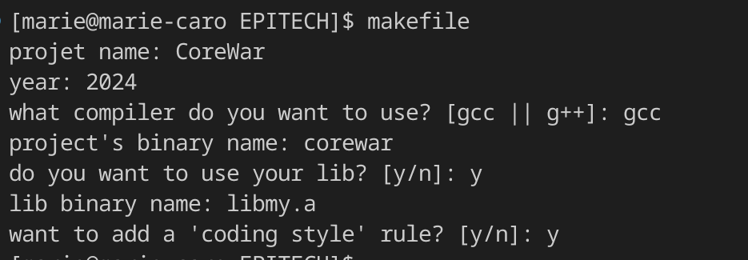
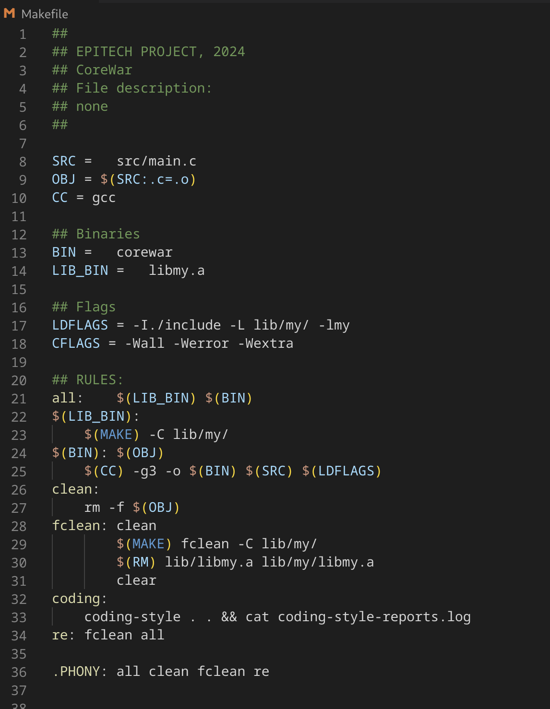

# Simple Makefile Generator {bash script}

# How to run the generator
```
$ ./makefile_gen
```

# How to access it from anywhere
1. Go into bashrc
```
$ emacs ~/.bashrc
```
2. Go to the end of the file and create the alias
```
alias makefile="$HOME/address"
```
-> makefile: name of the alias

-> "$HOME/address": absolute path of the script (where you stored it in your computer)


3. Save it and enter the following command in your terminal
```
source ~/.bashrc
```

-> Now whenever you type "makefile" in your terminal, the script is going to be executed

# Description
Bash script that creates a simple Makefile with the following rules:
    1. all
    2. clean
    3. fclean
    4. coding style
    5. compilation

# Preview



